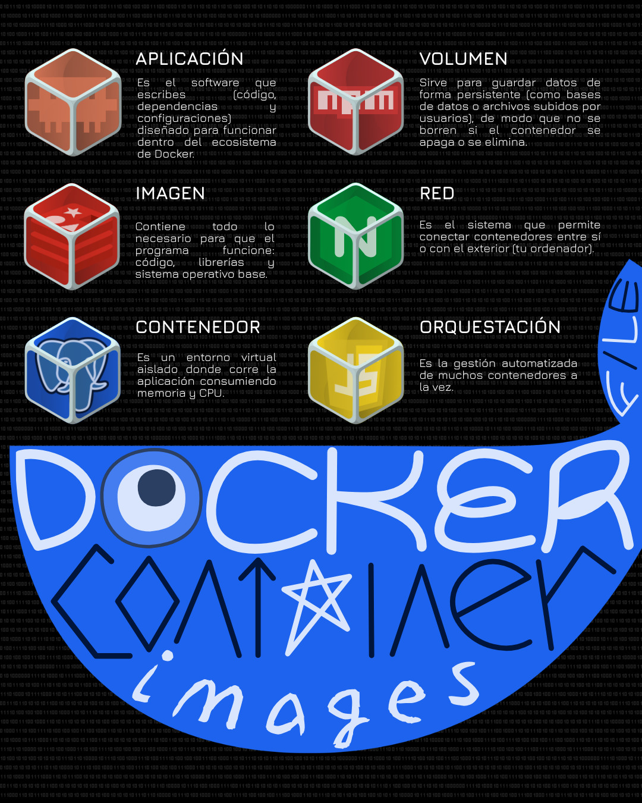

# Guía de Despliegue de Aplicaciones en Contenedores Docker




Este repositorio contiene la arquitectura de microservicios y la configuración necesaria para empaquetar, publicar y desplegar una aplicación multicapa utilizando Docker, Docker Compose y flujos de integración continua (CI/CD).

El proyecto está diseñado como un estándar técnico y de aprendizaje para la gestión moderna de infraestructura de software y despliegue en contenedores.

---

## 1. ¿Qué hace la solución?

La solución permite empaquetar y aislar la aplicación junto con sus dependencias en contenedores ligeros y portables, garantizando la consistencia del entorno tanto en desarrollo como en producción.

### Funcionalidades principales

* **Aislamiento de entornos:** Encapsulamiento de la aplicación (frontend/backend) y la base de datos en entornos independientes pero interconectados.
* **Orquestación simplificada:** Gestión de múltiples servicios mediante `docker-compose.yml` para levantar la infraestructura completa con una sola instrucción.
* **Automatización CI/CD:** Publicación automática de imágenes de Docker hacia un registro de contenedores (Docker Hub o GitHub Packages) tras cada confirmación en la rama principal.
* **Persistencia y Redes:** Configuración de volúmenes para el almacenamiento persistente de datos y redes virtuales dedicadas para asegurar la comunicación interna entre servicios.

---

## 2. Requisitos de Instalación por Sistema Operativo

Antes de ejecutar la aplicación, asegúrese de cumplir con los siguientes requisitos en su sistema operativo:

### Windows
* Windows 10/11 Home, Pro, Enterprise o Education (64 bits).
* WSL 2 (Windows Subsystem for Linux 2) habilitado.
* Virtualización habilitada en el BIOS/UEFI.
* Git instalado en la línea de comandos.

### macOS
* macOS versión 10.15 (Catalina) o posterior.
* Arquitectura basada en procesadores Intel o Apple Silicon (M1/M2/M3).
* Git instalado (`xcode-select --install`).

### Linux (Ubuntu / Debian / RHEL)
* Kernel de Linux versión 3.10 o superior.
* Acceso a la terminal con privilegios de superusuario (`sudo`).
* Git instalado (`sudo apt install git` o equivalente según la distribución).

---

## 3. Instalación Paso a Paso

Siga las instrucciones específicas para su sistema operativo hasta levantar la solución completa con `docker compose up -d`.

---

### Opción A: Instalación en Windows

#### Paso 1: Habilitar WSL 2
Abra PowerShell como Administrador y ejecute:
```powershell
wsl --install
```
*Reinicie el sistema si la consola se lo solicita.*

#### Paso 2: Instalar Docker Desktop
1. Descargue el instalador de Docker Desktop para Windows desde el sitio oficial.
2. Siga el asistente de instalación asegurándose de marcar la opción **"Use WSL 2 instead of Hyper-V"**.
3. Inicie Docker Desktop al finalizar y acepte los términos de servicio.

#### Paso 3: Clonar el repositorio y ejecutar la solución
Abra Git Bash, PowerShell o CMD y ejecute:

```powershell
# Clonar el repositorio
git clone https://github.com/christopherFall/app-deploy-docker.git

# Ingresar al directorio del proyecto
cd app-deploy-docker

# Construir y levantar los contenedores en segundo plano
docker compose up -d
```

---

### Opción B: Instalación en macOS

#### Paso 1: Instalar Docker Desktop
1. Descargue el instalador `.dmg` de Docker Desktop correspondiente a su procesador (Intel o Apple Silicon).
2. Abra el archivo `.dmg` y arrastre la aplicación Docker a la carpeta **Aplicaciones**.
3. Inicie la aplicación Docker y otorgue los permisos requeridos por el sistema.

#### Paso 2: Clonar el repositorio y ejecutar la solución
Abra la Terminal de macOS y ejecute:

```bash
# Clonar el repositorio
git clone https://github.com/christopherFall/app-deploy-docker.git

# Ingresar al directorio del proyecto
cd app-deploy-docker

# Construir y levantar los contenedores en segundo plano
docker compose up -d
```

---

### Opción C: Instalación en Linux (Ubuntu/Debian)

#### Paso 1: Instalar Docker Engine y Docker Compose
Ejecute la siguiente secuencia de comandos en su terminal:

```bash
# Actualizar el índice de paquetes e instalar dependencias básicas
sudo apt-get update
sudo apt-get install -y ca-certificates curl gnupg lsb-release

# Agregar la clave GPG oficial de Docker
sudo mkdir -p /etc/apt/keyrings
curl -fsSL https://download.docker.com/linux/ubuntu/gpg | sudo gpg --dearmor -o /etc/apt/keyrings/docker.gpg

# Configurar el repositorio estable de Docker
echo \
  "deb [arch=$(dpkg --print-architecture) signed-by=/etc/apt/keyrings/docker.gpg] https://download.docker.com/linux/ubuntu \
  $(lsb_release -cs) stable" | sudo tee /etc/apt/sources.list.d/docker.list > /dev/null

# Instalar Docker Engine, CLI, Containerd y el plugin de Docker Compose
sudo apt-get update
sudo apt-get install -y docker-ce docker-ce-cli containerd.io docker-buildx-plugin docker-compose-plugin

# Agregar el usuario actual al grupo docker para evitar el uso de sudo en cada comando
sudo usermod -aG docker $USER
newgrp docker
```

#### Paso 2: Clonar el repositorio y ejecutar la solución
```bash
# Clonar el repositorio
git clone https://github.com/christopherFall/app-deploy-docker.git

# Ingresar al directorio del proyecto
cd app-deploy-docker

# Construir y levantar los contenedores en segundo plano
docker compose up -d
```

---

### Verificación del despliegue (Todos los Sistemas Operativos)

Para verificar que los servicios estén en ejecución:

```bash
# Consultar el estado de los contenedores activos
docker compose ps

# Inspeccionar los registros de ejecución
docker compose logs -f
```

Para detener la infraestructura:

```bash
docker compose down
```

---

## 4. Publicación Automática de la Imagen (CI/CD)

El proyecto utiliza **GitHub Actions** para automatizar el proceso de construcción (*build*) y publicación (*push*) de las imágenes de Docker hacia un registro de contenedores (Docker Hub).

### Flujo de Trabajo (Workflow)

Cada vez que se realiza un evento `push` o un `pull_request` a la rama principal (`main` o `master`), se activa de forma automática la pipeline definida en el archivo `.github/workflows/deploy.yml`.

### Estructura típica del archivo de automatización (`.github/workflows/deploy.yml`)

```yaml
name: Publicación Automática en Docker Hub

on:
  push:
    branches:
      - main
      - master

jobs:
  build-and-push:
    runs-on: ubuntu-latest

    steps:
      - name: Descargar el código fuente
        uses: actions/checkout@v4

      - name: Iniciar sesión en Docker Hub
        uses: docker/login-action@v3
        with:
          username: ${{ secrets.DOCKERHUB_USERNAME }}
          password: ${{ secrets.DOCKERHUB_TOKEN }}

      - name: Configurar Docker Buildx
        uses: docker/setup-buildx-action@v3

      - name: Construir y publicar la imagen
        uses: docker/build-push-action@v5
        with:
          context: .
          file: ./Dockerfile
          push: true
          tags: |
            ${{ secrets.DOCKERHUB_USERNAME }}/app-deploy-docker:latest
            ${{ secrets.DOCKERHUB_USERNAME }}/app-deploy-docker:${{ github.sha }}
```

### Requisitos previos en GitHub

Para que la publicación automática funcione correctamente, se deben configurar los Secretos del Repositorio (*Repository Secrets*):

1. Ir al repositorio en GitHub -> **Settings** -> **Secrets and variables** -> **Actions**.
2. Crear la variable secret: `DOCKERHUB_USERNAME` con el nombre de usuario de Docker Hub.
3. Crear la variable secret: `DOCKERHUB_TOKEN` con un Access Token generado desde Docker Hub (en **Account Settings** -> **Security** -> **New Access Token**).

### Resultado del Proceso
1. El código se valida y empaqueta en un entorno aislado de GitHub.
2. La imagen compilada se etiqueta con `:latest` y con el hash único del commit.
3. La imagen queda disponible de manera pública o privada en Docker Hub para ser desplegada en cualquier servidor remoto.